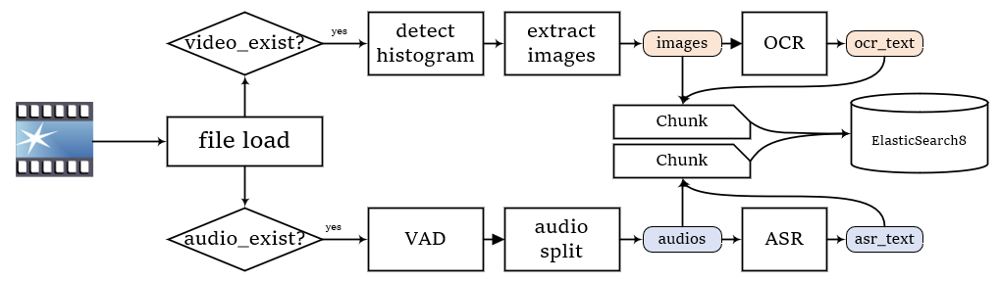
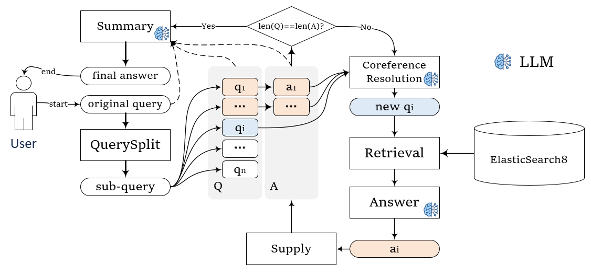

# MMeRAG

<a href="README_en.md">English</a>
&nbsp;&nbsp;&nbsp;&nbsp;&nbsp;&nbsp; 
中文

## 项目介绍
MMeRAG
本项目是一个音视频RAG项目，包括了对音频和视频的解析，加载，然后存储和问答。技术上其实也没有太复杂。
只不过是把文档RAG的文档解析部分替换成了对音视频的OCR和ASR等内容。
顺便靠这个把RAG整个流程打通，作为个人练习项目。

注1：前后端不打算做的太复杂，个人精力有限，未来的关注重点在于加载解析、检索生成这类算法流程的优化上，整体的设计模式应该不会有太大改变，如果对于如何提高RAG系统交互友好度、如何多模型支持、工作流实现等等可能不会有太多进展，实在个人精力有限，建议关注RAGFlow、QAnything以及Dify等成熟的开源项目。

注2：项目定位在单用户情境下，因此几乎不考虑异步操作，如果对本项目感兴趣，且希望改为多用户异步，请自行修改添加。
## 项目结构

大致结构如下，介绍关键的内容
- apis:后端部分
  - core_apis : 检索、问答的api接口
  - crud_apis ： crud的api接口
  - utils: 依赖注入、其他后端工具方法等
- config： 配置文档
- database： sql数据库
- kb（位置可自定义）
  - content ： 存储sql表
  - raw： 上传下载文档所在
  - tmp： load过程的临时文件，（会在运行中删除）
- models 模型文件存放（位置可自定义）
- loader：加载器与解析器
  - audio_parser
  - viedo_parser
  - mme_loader: 加载器
- rag:   rag核心部分
  - embed 向量化
  - llm 大模型相关
  - reranker  重排序
  - chunk    块，相当于一般rag项目的document
  - control  rag控制核心
  - elastic_vector   ES知识库
- web:   前端部分 streamlit实现
- app.py    后端入口
- webui.py  前端入口

## 技术栈
- 前端：streamlit
- 后端：Python / FastAPI
- 数据库：ElasticSearch8 / SQLite
- 向量化：Visualized BGE Embedding
- 音频解析：
  - 音频读取： ffmpeg
  - 语音识别： funasr + SenseVoice
  - 音频切割：vad_fsmn
- 视频解析：
  - 视频场景定位：直方图方案
  - OCR方案： RapidOCR

## 技术介绍

比较重要的地方就两个
1. 读取->解析->存储
2. 检索->生成

其他的部分就是CRUD，没有太多值得说的，本项目初建，重点在于第一个过程，也就是怎么解析文档，
而第二个过程，检索生成的部分还没做太多的东西，这个也是之后要增强改进的地方，计划引入一些高级RAG处理方案
比如self-rag之类的。

#### 文件加载：读取分块
文档读取的流程如下，基本上就是音视频读取然后转为chunk的过程，中途用到了直方图检测、VAD、ASR、OCR等技术，
体现在loader.MMeLoader.load()函数中

#### RAG方案：问题分解
对应rag.control.RAGController.query_decompose_rag()函数中

这是一个带有问题分解的RAG流程示意图，（Retrieval以及问答等部分做了简化记录，重点展示了问题分解的流程）

大致上是这样的：首先对问题进行分解，但是分解之后有个问题，后续的问题和前面的问题相关，可能有一些指代，这些指代是必须消除的。\
然后对每个问题做回答，每次问答流程是这样的：\
如果要尝试回答第i个问题的时候，将前i-1个问答对作为信息，消除问题中的指代，得到第i个真实的问题，然后进行检索->问答，将答案再补充到列表里。\
直到所有的问题都回答完毕，将问答对（完整版）和原始答案组合在一起，让大模型对回答进行整理。

-----

另外解释一下为什么要做消除指代，实际上的流程可能是这样的：\
问题： 霍去病的弟弟做过什么事情？\
经过分解后的问题：\
a. 霍去病的弟弟是谁？
b. 这个人做过什么事情？
如果直接检索a问题，没啥问题，但是如果检索b问题，那问题就太大了，根本找不到关键词，必须要进行**指代消除**，将b问题改为“霍光做过哪些事情”，所以就需要大模型处理了。

#### RAG方案：检索流程
上图中，RAG流程的检索部分被Retrieval这个示意块简化示意了，但这个地方实际上是比较复杂的，具体也是体现在
目前来说，这里只是对应rag.control.RAGController.retrieval()函数和rerank函数中。
目前的话就是一个多重检索方式的选择而已，没有涉及到路由、转换之类的。

我还在思考该咋写，考虑怎么改成模块化RAG，但是这个地方优先级不太高，暂时先搁置

## 快速开始

请参考文档 [quick_start](assert/doc/quick_start.md)

## 参考项目
RAG部分的参考：
1. [RAGFlow](https://github.com/infiniflow/ragflow)
2. [QAnything](https://github.com/netease-youdao/qanything)
3. [Dify](https://github.com/langgenius/dify)  

前端部分的参考：
4. [streamlit chatbot](https://blog.csdn.net/qq_39813001/article/details/136180110)

## 更新日志

- [2024-09-23] 解决了日志问题，更新了configs的配置方式，删除了一些不重要的计划，添加了一些小改动。

## TODOLIST

### 业务方面

- [ ] 多类型支持，目前仅支持mp4格式（前端部分仅支持mp4,理论上后端是ffmpeg支持的都可以）
- [ ] （加入历史信息后）设置检索选项：本次对话是否检索，是否自动评估本次是否检索等。

### 算法方面

- [ ] 视频文本生成方面，考虑添加入VL大模型支持。
- [ ] 设置来源倾向，比如本次回答更倾向于使用音频结果而不是是视频信息等
- [ ] 大模型问答环节加入历史信息部分。
- [ ] （加入历史信息后）支持多轮对话检索增强生成。
- [ ] 尝试解决语音识别多音字的问题，想办法矫正 难度较大。
- [ ] 音视频对齐的检索，这个难度过大，暂时不知道怎么做。

