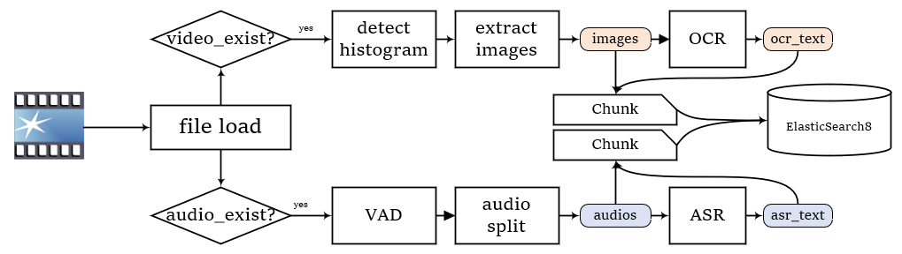

# MMeRAG

English
&nbsp;&nbsp;&nbsp;&nbsp;&nbsp;&nbsp; 
<a href="README.md">中文</a>

## Introduction
MMeRAG
This project is an audio and video RAG project, which includes the parsing, loading, storage, and Q&A of audio and video. Technically, it's not too complicated either.
It's just replacing the document parsing part of the RAG with OCR and ASR for audio and video.
By the way, use this to streamline the entire RAG process as a personal practice project.

Note 1: The front-end and back-end development will not be made overly complex due to limited personal resources. Future focus will be on optimizing the algorithms for loading, parsing, searching, and generating within the RAG system. There shouldn't be significant changes to the overall design pattern. If there is interest in enhancing aspects such as user interaction friendliness of the RAG system, multi-model support, workflow implementation, etc., progress might be limited due to personal capacity constraints. It is recommended to look into mature open-source projects like RAGFlow, QAnything, and Dify.

Note 2: The project is designed for single-user scenarios, thus asynchronous operations are largely not considered. Should anyone be interested in this project and wishes to modify it for multi-user asynchronous use, they are encouraged to make their own adjustments and additions.

## Structure

The general structure is as follows, introducing the key content:
- apis: Backend component
  - core_apis: API interfaces for retrieval and question answering
  - crud_apis: API interfaces for CRUD operations
  - utils: Dependency injection and other backend utility methods
- config: Configuration documents
- database: SQL database
- kb (location customizable)
  - content: SQL table storage
  - raw: Location for uploading and downloading documents
  - tmp: Temporary files during loading (deleted during runtime)
- models: Model file storage (location customizable)
- loader: Loaders and parsers
  - audio_parser
  - video_parser
  - mme_loader: Loader
- rag: Core RAG component
  - embed: Vectorization
  - llm: Large language model related
  - reranker: Re-ranking
  - chunk: Chunks, equivalent to documents in typical RAG projects
  - control: RAG control core
  - elastic_vector: ES knowledge base
- web: Frontend component implemented with Streamlit
- app.py: Backend entry point
- webui.py: Frontend entry point

## Technology Stack
- Front-end:streamlit
- Back-end:Python / FastAPI
- DataBase:ElasticSearch8 / SQLite
- Vector:Visualized BGE Embedding
- Audio-Parser:
  - Audio-Reading: ffmpeg
  - ASR: funasr + SenseVoice
  - Audio-Spliter:vad_fsmn
- Video-Parser:
  - Scene-Position:histogram
  - OCR: RapidOCR

## Technical Introduction

There are two particularly important aspects:

1. Read -> Parse -> Store
2. Retrieve -> Generate

Other parts are simply CRUD operations, not much to elaborate on. 
As this project is still in its initial stages, the focus is primarily on the first process—how documents are parsed. The second process, concerning retrieval and generation, has not yet been extensively developed; this is an area that will be enhanced and improved later on, potentially incorporating advanced RAG (Retrieval-Augmented Generation) solutions like self-rag.

#### File Loading: Reading in Chunks
The document reading process is akin to reading audio/video files and converting them into chunks. This involves technologies such as histogram detection, VAD (Voice Activity Detection), ASR (Automatic Speech Recognition), and OCR (Optical Character Recognition). 
This is reflected in the function loader.MMeLoader.load().

#### RAG Solution: Question Decomposition
This is illustrated in the RAG process diagram with question decomposition (the retrieval and Q&A parts are simplified for clarity, focusing on the decomposition process).

Generally, it works like this: First, the question is decomposed. However, after decomposition, there is an issue where subsequent questions are related to previous ones and may contain some references that need to be resolved.
Then each sub-question is answered. Each Q&A session follows this pattern:

When attempting to answer the i-th question, use the previous i-1 Q&A pairs as context to resolve references within the question, thereby obtaining the concrete i-th question;
Proceed with retrieval->Q&A, and add the answer to the list;
Continue until all questions have been answered, then combine the complete Q&A pairs with the original answers for summarization by the large model.
Additionally, here's why reference resolution is necessary. The actual process might look something like this:

Question: What did Huo Qubing's brother do?
After decomposition, the questions become:
a. Who was Huo Qubing's brother?
b. What did this person do?
Retrieving for question a is straightforward, but retrieving for question b is too broad without keywords, so reference resolution is required to transform question b into "What did Huo Guang do?" which necessitates handling by the large model.

#### RAG Solution: Retrieval Process

In the diagram above, the retrieval part of the RAG process is simplified as the "Retrieval" block, but in reality, this part is quite complex. Specifically, at present, this is only reflected in the rag.control.RAGController.retrieval() function and the re-ranking function. Currently, it's just a choice of multiple retrieval methods without involving routing or transformation.

I am still considering how to write this part and thinking about transforming it into a modular RAG, but this task has a lower priority and is thus put on hold for now.

## Quick Start

Check this [quick_start](assert/doc/quick_start_en.md)

When you deploy and successfully start the project, it looks like this:

## Reference

RAG：
1. [RAGFlow](https://github.com/infiniflow/ragflow)
2. [QAnything](https://github.com/netease-youdao/qanything)
3. [Dify](https://github.com/langgenius/dify)  

Front：
4. [streamlit chatbot](https://blog.csdn.net/qq_39813001/article/details/136180110)

## Change Log

[2024-09-23] Resolved logging issues, updated the configuration method for configs, removed some less critical plans, and added a few minor changes.

## TODO List

### Business Aspect
- [ ] Support multiple types; currently, only mp4 format is supported (front-end supports only mp4, theoretically, the back-end can support any format that ffmpeg does).
- [ ] (After integrating historical information) Set retrieval options: whether to retrieve in this conversation, whether to automatically evaluate if retrieval should occur, etc.
### Algorithm Aspect
- [ ] For video text generation, consider adding support for VL large models.
- [ ] Set source preference, e.g., favor audio results over video information for this response.
- [ ] Integrate historical information into the large model Q&A phase.
- [ ] (After integrating historical information) Support multi-turn dialogue retrieval-enhanced generation.
- [ ] Attempt to solve the issue of homophones in speech recognition; finding ways to correct this is challenging.
- [ ] Audio-video alignment for retrieval; this is very difficult and currently no clear approach exists.
