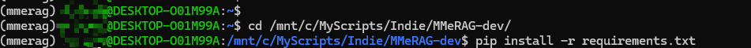

## 快速开始

对不起，好像快速不起来
目前没做docker快速部署，只能一步步来。\

首先介绍一下本人的环境: win11 + wsl(ubuntu 22.04 cuda12.4, 显卡为4060ti 16GB 内存32GB,
如果是个人电脑的话建议内存不要太小否则可能会比较卡)

本项目使用的知识库是ES，所有要先部署ES


##### 项目要求，建议至少有一张8GB以上显存的显卡可供使用。并且提前配置号cuda环境等等。


**首先复制项目到你的项目路径下。**

1. docker方式本地部署ES8

[官方演示：docker方式安装ElasticSearch](https://www.elastic.co/guide/en/elasticsearch/reference/8.14/docker.html	)

```shell
# linux方式或windows(WSL)
# 网络隔离，创建一个docker网络.
docker network create elastic

# 拉取es的docker镜像
docker pull docker.elastic.co/elasticsearch/elasticsearch:8.14.3

# 启动docker，注意，设置成你所需要的密码
docker run --name es01 --net elastic -p 9200:9200 -it -m 1GB -e "ELASTIC_PASSWORD=your_password" docker.elastic.co/elasticsearch/elasticsearch:8.14.3
 
# 获取CA证书，之后有用
docker cp es01:/usr/share/elasticsearch/config/certs/http_ca.crt .

# 可以将密码写入环境变量
export ELASTIC_PASSWORD="your_password"

# 验证是否启动成功
curl --cacert http_ca.crt -u elastic:$ELASTIC_PASSWORD https://localhost:9200
```

当成功部署之后，会展示得到下面的样式的结果


保留http_ca.crt 将其放到项目目录下（具体对应的是config.mme_rag_config.CA_CERTS）


2. 申请API_KEY

本项目所用的api为智谱平台的GLM4系列大模型，url设置在config.mme_rag_config.py中配置，
其默认值为CHAT_URL='https://open.bigmodel.cn/api/paas/v4/chat/completions'
调用方式为request响应，具体可见rag.llm.online_llm.ChatAPILLM.chat_base，
如果需要自行修改请前往该函数进行自定义修改。

总之，如果想要直接使用，必须去[智谱AI大模型开放平台](https://open.bigmodel.cn) 申请一个APIKey，配置到你的**环境变量**当中

包括ELASTIC—PASSWORD在内，一共配置两个密码，如果你是Linux平台，则大致如下


3. 系统软件配置

请安装ffmpeg并将其添加到环境变量中
如Linux用户使用以下命令安装
```shell
sudo apt update
sudo apt install ffmpeg
```


4. python环境配置，建议使用conda 

首先创建新的conda环境（以下以Ubuntu 22.04为例
```shell
conda create -n mmerag python=3.11
y   # 确认
conda activate mmerag
```


进入你项目所在的目录，然后安装
```shell
cd /your/project/path
pip install -r requirement.txt
```

中间可能遇到网络问题，建议通过配置镜像等方式解决

5. 配置模型文件，（这一步在config.config_check.py中已经实现了，如果不乱动的话，理论上可以自动实现，（并没有仔细的验证过）。
如果需要自己修改路径，请在config/mme_rag_config.py中修改

如果手动下载：
需要下载五个模型文件，分别是向量化、音频解析用到的，这些路径全部都在config/mme_rag_config.py中配置了

（2024-09-09：发现了点问题，bge-visualized的下载方法不会只下载一个.pth文件，可能需要你手动下载或者指定一下路径，确保vis_m3_path这个路径只会指向一个单独的文件，这个没太搞明白啥情况，之后再看吧）

> - 这两个是图文向量化所用的模型，请参考[FlagEmbedding](https://github.com/FlagOpen/FlagEmbedding)，因为我修改了一下FlagEmbedding的代码，所以可能得单独下载这两个模型。
>   - [BAAI/Visualized-BGE](https://huggingface.co/BAAI/bge-visualized) - 对应vis_m3_path，这个没找到ModelScope路径
>   - [BAAI/bge-m3](https://www.modelscope.cn/models/Xorbits/bge-m3/) - 对应vis_cfg_path
> - 音频解析用的，分别是语音识别和语音中断检测，请参考[SenseVioce](https://github.com/FunAudioLLM/SenseVoice)
>   - [iic/SenseVoiceSmall](https://www.modelscope.cn/models/iic/SenseVoiceSmall) - 对应SENSE_VOICE_MODEL_PATH
>   - [icc/vad_fsmmn](https://www.modelscope.cn/models/iic/speech_fsmn_vad_zh-cn-16k-common-pytorch/summary) - 对应SENSE_VOICE_VAD_MODEL_PATH
> - Reranker
>   - 文档重排序所用的模型，参考[BGE-Reranker-v2-m3](https://www.modelscope.cn/models/AI-ModelScope/bge-reranker-v2-m3/summary) 对应reranker_path
> 

将其放入到config.mme_rag_config.py里面记录的对应路径的文件夹当中即可。


5. 后端程序运行：运行程序 python app.py


注意，第一次启动需要下载模型文件，可能用时比较长


如果启动期间有ES配置问题，首先检查ES是否启动、密码是否填写，以及http_ca.crt证书是否存在等。
默认是在8000端口 本地部署，修改config.servcer_config.back_host和back_port
(注意：启动后如果报错不存在xx文件，则很有可能是你没有把证书文件放入项目中。)


6. 启动前端程序，

新开一个shell，进入项目路径
输入streamlit run webui.py --server.address 0.0.0.0 --server.port 8502 启动
注意请输入你的端口和ip地址

```shell
streamlit run webui.py --server.address 0.0.0.0 --server.port 8502
```


