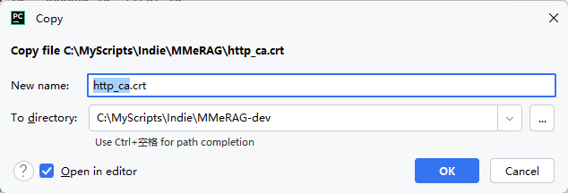
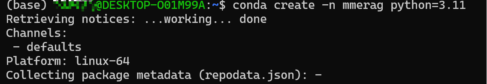
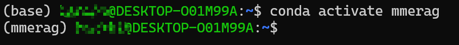

## Quick Start

Sorry, it doesn't seem to be quick.
Currently, there's no Docker setup for rapid deployment, so you'll have to do it step-by-step.

First, let me introduce my environment: Win11 + WSL (Ubuntu 22.04 with CUDA 12.4, GPU is RTX 4060 Ti with 16GB VRAM and 32GB RAM).
If it's a personal computer, I suggest not having too little memory, otherwise, it might be laggy.

The knowledge base used in this project is Elasticsearch (ES), so you need to deploy ES first.

##### Project Requirements: It is recommended to have at least one GPU with more than 8GB of VRAM available and have the CUDA environment set up in advance.

**First, copy the project to your project path.**

1. Deploy ES8 locally using Docker

[Official Demo: Installing Elasticsearch Using Docker](https://www.elastic.co/guide/en/elasticsearch/reference/8.14/docker.html	)

```shell
# Linux method or Windows (WSL)
# Network isolation, create a Docker network.
docker network create elastic

# Pull the ES Docker image
docker pull docker.elastic.co/elasticsearch/elasticsearch:8.14.3

# Start Docker, note to set the password as needed
docker run --name es01 --net elastic -p 9200:9200 -it -m 1GB -e "ELASTIC_PASSWORD=your_password" docker.elastic.co/elasticsearch/elasticsearch:8.14.3

# Get the CA certificate, it will be useful later
docker cp es01:/usr/share/elasticsearch/config/certs/http_ca.crt .

# You can write the password to an environment variable
export ELASTIC_PASSWORD="your_password"

# Verify if it started successfully
curl --cacert http_ca.crt -u elastic:$ELASTIC_PASSWORD https://localhost:9200
```

When the deployment is successful, you will see the following result:


Keep the `http_ca.crt` file and place it in the project directory (specifically corresponding to `config.mme_rag_config.CA_CERTS`).




2. 申请API_KEY

2. Apply for API_KEY

The API used in this project is from the Zhipu AI platform's GLM4 series of large models. The URL is configured in `config.mme_rag_config.py`, with the default value being `CHAT_URL='https://open.bigmodel.cn/api/paas/v4/chat/completions'`. The invocation method is via request response, and the specifics can be seen in `rag.llm.online_llm.ChatAPILLM.chat_base`. If you need to modify this yourself, please go to the function for custom adjustments.

In summary, if you want to use it directly, you must apply for an APIKey from the [Zhipu AI Large Model Open Platform](https://open.bigmodel.cn) and configure it in your **environment variables**.

Including the `ELASTIC_PASSWORD`, there are two passwords to configure. On a Linux platform, it would look something like this:


3. System Software Configuration

Please install ffmpeg and add it to your environment variables.
For Linux users, use the following command to install:
```shell
sudo apt update
sudo apt install ffmpeg
```


4. Python Environment Configuration, recommended to use conda

First, create a new conda environment (using Ubuntu 22.04 as an example):
```shell
conda create -n mmerag python=3.11
y   # Confirm
conda activate mmerag
```





Enter the directory of your project and then install the dependencies:
```shell
cd /your/project/path
pip install -r requirement.txt
```

Network issues may arise during installation; it is suggested to resolve these by configuring mirrors or other methods.

5. Configure Model Files (This step is already implemented in `config.config_check.py`; if left untouched, it should theoretically work automatically, although it hasn’t been thoroughly verified).

If you need to modify paths manually, do so in `config/mme_rag_config.py`.

If downloading manually:
Five model files need to be downloaded, which are used for vectorization and audio parsing. All paths are configured in `config/mme_rag_config.py`.

(As of 2024-09-09: An issue was found with the download method for `bge-visualized`; it does not download just a single `.pth` file. You may need to download it manually or specify the path to ensure that `vis_m3_path` points to a single file. This issue is not fully understood and will be revisited later.)

- These two models are used for text-image vectorization. Refer to [FlagEmbedding](https://github.com/FlagOpen/FlagEmbedding). Since I modified the FlagEmbedding code, you may need to download these models separately.
  - [BAAI/Visualized-BGE](https://huggingface.co/BAAI/bge-visualized) - Corresponds to `vis_m3_path`. No ModelScope path was found.
  - [BAAI/bge-m3](https://www.modelscope.cn/models/Xorbits/bge-m3/) - Corresponds to `vis_cfg_path`.
- For audio parsing, which includes speech recognition and voice activity detection, refer to [SenseVoice](https://github.com/FunAudioLLM/SenseVoice).
  - [iic/SenseVoiceSmall](https://www.modelscope.cn/models/iic/SenseVoiceSmall) - Corresponds to `SENSE_VOICE_MODEL_PATH`.
  - [icc/vad_fsmmn](https://www.modelscope.cn/models/iic/speech_fsmn_vad_zh-cn-16k-common-pytorch/summary) - Corresponds to `SENSE_VOICE_VAD_MODEL_PATH`.
- Reranker
  - The model used for document re-ranking. Refer to [BGE-Reranker-v2-m3](https://www.modelscope.cn/models/AI-ModelScope/bge-reranker-v2-m3/summary). Corresponds to `reranker_path`.

Place them in the corresponding folders specified in `config.mme_rag_config.py`.

5. Backend Program Execution: Run the program with `python app.py`

Note: During the first launch, model files need to be downloaded, which may take a considerable amount of time.


If there are ES configuration issues during startup, first check whether ES is running, if the password is filled in, and if the `http_ca.crt` certificate exists.

By default, it is deployed locally on port 8000. Modify `config.server_config.back_host` and `back_port`.

(Note: If you get an error message stating that a certain file does not exist after launching, it is likely that you have not placed the certificate file in the project directory.)


6. Launch the Frontend Program

Open a new shell, navigate to the project directory, and enter the following command to start the frontend:
```shell
streamlit run webui.py --server.address 0.0.0.0 --server.port 8502


```shell
streamlit run webui.py --server.address 0.0.0.0 --server.port 8502
```


